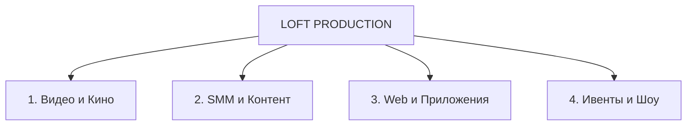

# КОММЕРЧЕСКОЕ ПРЕДЛОЖЕНИЕ О ПАРТНЕРСТВЕ

**От:** LOFT PRODUCTION  
**Для:** Маркетинговых и рекламных агентств  
**Тема:** Стратегический продакшн-партнер полного цикла (White Label / Outsourcing / Co-production)

---

## 🖐 Приветственное слово

**Уважаемая команда агентства!**

В маркетинге ключевую роль играет не только стратегия, но и то, насколько качественно, быстро и убедительно она воплощена визуально и технически. 

Команда **LOFT PRODUCTION** предлагает надежное партнерство для маркетинговых агентств. Мы готовы стать вашим бек-офисом и техническо-производственным крылом полного цикла, взяв на себя задачи по созданию медиаконтента, digital-разработке и организации мероприятий любой сложности.

> [!TIP]
> **Формат работы:** Мы можем работать как открытый субподрядчик или под вашей маркой (White Label), сохраняя единую коммуникацию с вашим клиентом.

---

## 🚀 4 ключевых направления LOFT PRODUCTION



### 1. 🎥 Видео- и Фото-продакшн (Видео & Кино)
Превращаем идеи и рекламные стратегии в визуальный контент премиального уровня:
* **AI-Видео & Генеративный продакшн:** Производство роликов и концептов с помощью ИИ (нейросетевая анимация, Sora, Midjourney, Runway Gen-2, виртуальные аватары):
  * [AI Видео #1 (YouTube)](https://youtu.be/LJZsjR0qF1U)
  * [AI Видео #2 (YouTube)](https://youtu.be/KqC2RqANGBk)
  * [AI Видео #3 (YouTube)](https://youtu.be/8Sb_5S9o-GQ)
* **Документальные & Корпоративные фильмы:** Производство презентационных, историческо-документальных и имиджевых фильмов о брендах, заводах и компаниях под ключ.
* **Имиджевые & Рекламные ролики:** ТВ-формат, OLV, ролики для социальных сетей и кинотеатров.
* **Предметная & Фуд-съемка:** Контент для брендов, каталоги, лукбуки, 3D-графика и VFX.
* **Репортажная съемка:** Аэросъемка (дроны), многокамерная съемка мероприятий, интервью, подкасты.
* **Полный цикл (Full Pipeline):** От разработки сценария и раскадровки до кастинга, локаций, цветокоррекции и дикторской озвучки.

### 2. 📱 SMM-поддержка & Визуальный контент
Замыкаем цикл регулярного контента для ваших клиентов:
* **Short-form Content:** Пакетное производство Reels, Shorts, TikTok (съемка до 30-50 роликов за 1-2 съемочных дня).
* **Единый визуальный код:** Создание фирменного сетчатого стиля, баннеров, анимаций, сторис.
* **Примеры реализации SMM:**
  * [Instagram @anzur.rest](https://www.instagram.com/anzur.rest/) — ресторанный комплекс
  * [Instagram @rudaki.house](https://www.instagram.com/rudaki.house/) — ресторан Рудаки Хаус
* **Комплексное ведение аккаунтов:** Модерация, комьюнити-менеджмент, таргетинг и работа с блогерами.

### 3. 💻 Digital-разработка (Web & Apps)
Создаем конверсионные цифровые продукты для решения бизнес-задач:
* **Промо-страницы и Лендинги:** Разработка под ключ (Tilda, Webflow или кастомная верстка React/Vue).
* **Корпоративные сайты & E-commerce:** Масштабируемые веб-ресурсы с интеграцией CRM, эквайринга и складских систем.
* **Мобильные и Веб-приложения:** iOS / Android (Flutter, React Native) и PWA-приложения.
* **UX/UI Дизайн:** Интерактивные прототипы, дизайн-системы, брендинг.

### 4. 🎪 Ивенты & Шоу (Events & Show)
Полный комплекс услуг по проведению мероприятий любого масштаба:
* **Корпоративные события & Презентации:** Презентации продуктов, форумы, B2B-конференции.
* **Концерты и Шоу:** Бронирование и букинг артистов, технический райдер, сцена, звук, свет, LED-экраны.
* **Режиссура & Сценарий:** Разработка шовранов, тайминга, шоу-программы и брендинга площадки.

---

## 🤝 Почему с нами выгодно работать

| Преимущество | Что это дает маркетинговому агентству? |
| :--- | :--- |
| **Увеличение LTV клиентов** | Вы расширяете спектр услуг без расширения собственного штата и ФОТ. |
| **Фиксированный процент (Партнерский прайс)** | Гарантированная маржинальность от **15% до 30%** на все услуги продакшна. |
| **Скорость & Бесшовность** | Оценка задач за 2 часа. Собственный парк техники, штатные режиссеры, продюсеры и разработчики. |
| **Соблюдение SLA & NDA** | Строгое следование дедлайнам и подписание NDA на этапе брифинга. |

---

## 🛠 Схема взаимодействия

```
1. Брифинг ──> 2. Смета & Концепция ──> 3. Реализация (NDA/White Label) ──> 4. Сдача & Выплата процента
```

1. **Запрос:** Вы передаете нам бриф или вводные от клиента.
2. **КП & Смета:** В течение 24 часов мы подготавливаем детальную смету и техническое решение в сомони.
3. **Производство:** За каждым проектом закрепляется персональный Project Manager от LOFT, работающий в режиме 24/7.
4. **Результат:** Сдача проекта в срок с передачей всех авторских прав.

---

## 📞 Готовы обсудить детали и встретиться!

Мы готовы провести онлайн-презентацию или личную встречу для обсуждения спецпрайса для партнерских агентств и разбора ваших текущих задач.

* **Продакшн:** LOFT PRODUCTION  
* **Телефон:** +992 1111 247 42  
* **Telegram:** [@maybeu](https://t.me/maybeu)  

---
> [!NOTE]
> При необходимости мы можем подготовить коммерческое предложение под конкретный тендер или конкретную задачу вашего клиента.
